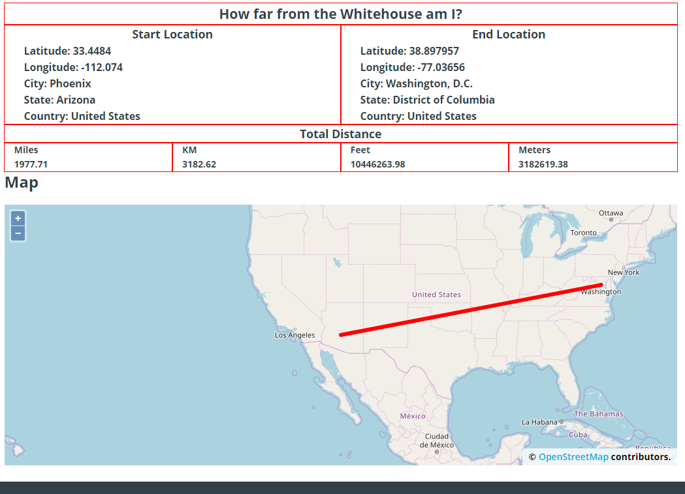

# distance_calc_demo_wordpress_plugin

# Working versions on word press site 
* https://mfales.com/all-skills/web-design/word-press/wordpress-plugin/
* Git hub repo https://github.com/MattFales/distance_calc_demo_wordpress_plugin.git

# Goal
* Stand alone plugin for wrodpress should work with all version
* Take user and calculate the distance from one point to the whitehouse

# First Way to Install
* Browse OS and add the distance-calc-demo.zip file and hit install
* Click ACTIVATE 
* if white screen uninstall it and try 2rd way

# 2rd WAY to Install PLEASE Follow these steps
* Browse OS and add the distance-calc-demo.zip file and hit install
## DO NOT CLICK ACTIVATE  click  Return to Plugin Installer   
## Then go to Installed Plugins 
## Then click Activate from there
* Short code [distance-calc-demo]

# OTHER Way Install PLEASE Follow these steps
* Unzip to any location 
* open word press file system
* go to public_html
* go to wp-content
* go to plugins
* copy that folder to this location
* go to  Installed Plugins 
* Then activate it

# how to unistall if you have problems
* open word press file system
* go to public_html
* go to wp-content
* go to plugins
* look for distance-calc-demo
* delete that folder

# Process 
* Grab user location through ip https://www.geoplugin.com/webservices/php good class to use
* Set up the calculations 
* Great-circle distance between two points https://stackoverflow.com/questions/10053358/measuring-the-distance-between-two-coordinates-in-php 
* NOTE: using API that may cost, may not work in the future due to changes, and adding extra step not needed.
* This code will work no matter what and will always give back the same results 
* This means it is stable version which will not risk any problems in the future 
* The table you see is built with bootstrap 4/ Version of WordPress uses
* Table will work on mobile 
---
* The map
* This is built with free API called openlayers https://openlayers.org/
* Shows you the line between to the locations 
* NOTE: this is Javascript based, meaning the variables are taken from php from the first part of the code

# Code Notes
* For short code add_shortcode('distance-calc-demo', 'distance_calc_demo'); 
* Fixed locations points Fixed location https://www.latlong.net/place/the-white-house-washington-dc-usa-20381.html

# Testing 
* VPN to change location
* Validation on distance  http://www.meridianoutpost.com/resources/etools/calculators/calculator-latitude-longitude-distance.php?
* There is always a chance it not exact location base on IP.  This is due to where the server is located.  

---

